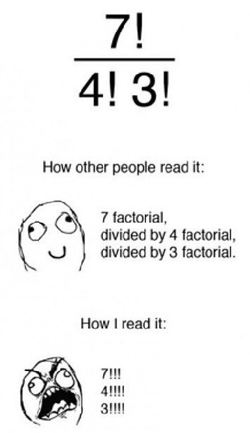
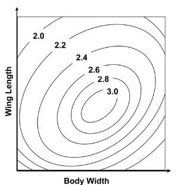
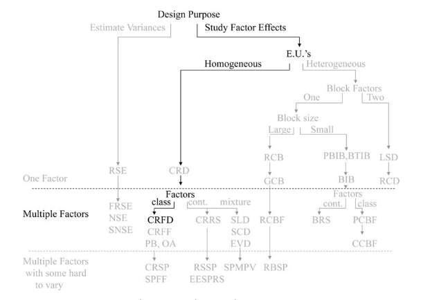

```{r setup, include=FALSE}
knitr::opts_chunk$set(echo = TRUE)
if(!require(daewr)){
  install.packages("daewr")
}
if(!require(tidyverse)){
  install.packages("tidyverse")
}
if(!require(MASS)){
  install.packages("MASS")
}
if(!require(agricolae)){
  install.packages("agricolae")
}
if(!require(multcomp)){
  install.packages("multcomp")
}
if(!require(car)){
  install.packages("car")
}
if(!require(lsmeans)){
  install.packages("lsmeans")
}
if(!require(rsample)){
  install.packages("rsample")
}
  library(daewr)
  library(tidyverse)
  library(MASS)
  library(agricolae)
  library(multcomp)
  library(car)
  library(lsmeans)
  library(rsample)
```

# Introduction

This document will cover the procedures required when dealing with multiple factors in a Design of Experiments (DoE). This is a follow up of 01_Completely_randomized_design_in_R.  

Since measuring the interactions between many factors that in themselves may have many levels the design can grow exponentialy in size.  



Based on the work:  
_Lawson, John. Design and Analysis of Experiments with R. Chapman and Hall/CRC, 20141217. VitalBook file._

## Basics

You might be tempted to just vary each variable one at a time and try to draw inference from the results but the following picture nicely illustrates the shortcomings of this approach:  


Using a very simple example of aircraft flight times measured via body width and wing size one might look at the following plot and assume the larger the body the better:  


In reality there is a co-dependant relationship between the body width and the wing span. In order to visualize the optimal setting we must vary these parameters together, not only one at a time:  




In this visualization of factorial interactions between the 2 variables we can clearly see that there is an optimal combination of variables.  

## Roadmap

In this post we will briefly cover Completely Randomized Factorial Designs (CRFD)



## Creating a two factor factorial plan 

Let's see how factorial plans can be set up in R:  

We will follow through with the example of testing flight times as a response to body width and wing length of an airplane. To set up factorial combinations for these variables we call the `expand.grid` function  

```{r}
factorial_design_example <- expand.grid(BW = seq(3,5,length.out = 5),
                                        WL = seq(4,6, length.out = 3))

factorial_design_example
```

If we wanted to create 3 replication in each we can either add this in the `expand.grid` or we can duplicate the entire set 3 times:  

```{r}
factorial_design_example <- expand.grid(BW = seq(3.25,4.25,length.out = 3),
                                        WL = seq(4,6, length.out = 3),
                                        replicate_nr = 1:2)

factorial_design_example
```

Now we randomize the design:  

```{r}
factorial_design_example <- factorial_design_example[sample(nrow(factorial_design_example)),]

factorial_design_example
```

We don't want to include `replicate` as a factor so we can remove it if it is no longer useful:  

```{r}
factorial_design_example <- factorial_design_example[,-3]
factorial_design_example %>% head
```

## Hypothesis testing - factorial designs

Similar to the CRD case our design relationship between the response variable and the factors can be represented mathematically:  

**Cell mean**  
$y_{i,j,k} = \mu_{i,j} + \epsilon_{i,j,k}$

**Effects model**  
$y_{i,j,k} = \mu + \alpha_i + \beta_j + (\alpha.\beta)_{i,j} + \epsilon_{i,j,k}$

When we want to investigate the treatment effects of the 2 factor factorial design the effects model is used when we fit anova models to the design matrix.  
As with the CRD; internal calls to anova/lm() will use the 1st observation in the design matrix for each factor as a baseline. The following matrix representation illustrates how the sum of squares is minimised in R:  


When interpreting the summary outputs of these anova models in R the following picture may be very helpful:  


We can evaluate the effect for the interaction terms as well as the factors using the p-values in this table. Again rejecting the null hypothesis implies that there is some effect in choosing specific factor levels/interactions.  

### Anova example

For this example we will load some data from the package `daewr` on fuel emissions.  

Let's see this in action:  

```{r}
anova_data <- daewr::COdata

anova_model <- aov(CO ~ Eth * Ratio, data = anova_data)

anova_model %>% summary
```

Interesting, so we can see that both the factors and their interaction reject the null hypothesis that they have no effect on the response (carbon monoxide).  

### Investigate treatment means

If we wanted to compare the treatment means we can use the `model.tables` function with `type = "means"`:

```{r}
anova_model %>% model.tables(type = "means", se = TRUE)
```

And we can also investigate the effects by setting `type = "effects"`:  

```{r}
anova_model %>% model.tables(type = "effects", se = TRUE)

```

### Interaction plots

It is fairly simple to plot the interactions between variables across factor levels

```{r}
anova_data %>% 
  group_by(Eth,Ratio) %>% 
  summarise(CO = mean(CO)) %>% 
  ggplot(aes(x = Eth, y = CO))+
  geom_line(aes(group = Ratio, color = Ratio))+
  ggtitle("CO emissions vs Ethanol across factor levels")


```

This illustrates that inference about a causal relationship should not be made without context about the interactions wit other factors and their levels

Let's repeat for Ratio vs CO:  

```{r}
anova_data %>% 
  group_by(Eth,Ratio) %>% 
  summarise(CO = mean(CO)) %>% 
  ggplot(aes(x = Ratio, y = CO))+
  geom_line(aes(group = Eth, color = Eth))+
  ggtitle("CO emissions vs Ratio across factor levels")
```

## Determining the number of replicates

Again, as with the CRD designs, we must find the amount of replicates that will give us sufficient power in correctly rejecting the null hypothesis. 

In order to just that we use the `daewr::Fpower1` function. the `1` means it is a one sided test. 

We assume we have 4 levels on both factors.  

In order to use this function we need to specify what measure of change we would like to measure/catch in the repsonse with power of x%. We also need to specify the amount of variance present.

To calculate the amount of variance we can use:

```{r}
sigma <- anova_model %>% residuals() %>% var %>% sqrt()
sigma
```

And if we assume we want to measure a $\Delta = 1$ we can measure the replications required with:  

```{r}
power_table <-  daewr::Fpower1(alpha = 0.05, nlev = 16, nreps = seq(40,150,length.out = 15),Delta = 1, sigma = sigma)

power_table
```

So based on the current data, without any screening data we required roughly ~100 replications of each treatment to reach 80% power (if we want to notice/reject based on a 1 unit change in cell means).  

If we wanted to notice a 1 unit change in the marginal distributions we can use the `Fpower2` function for the 2 factors:

```{r}
power_table <-  daewr::Fpower2(alpha = 0.05, nlev = c(4,4), nreps = seq(10,50,length.out = 15),Delta = 1, sigma = sigma)

power_table
```

Using these power tests we can determine how many replicants we need to answer which questions. If we were only interested in investigating the behaviour of the marginal distributions we would inevitably require less replications than if we needed to test hypotheses on the overall cell means. 

How about our assumptions? Let's call our validation script on each of the 2 factors:  

**Eth**

```{r, echo=FALSE,results=FALSE,include=FALSE}
source(knitr::purl("01_Completely_randomized_design_in_R.Rmd"))
```

```{r}

Validate_assumptions(model = anova_model,factor = "Eth",df = daewr::COdata)
```

**Ratio**

```{r}
Validate_assumptions(model = anova_model,factor = "Ratio",df = daewr::COdata)
```

These plots don't show anything too wild, so this should bolster some confidence.  

## Unequal number of replicants

Up until now we have always had an equal number of replicants in all our treatments. How does the analysis change when we introduce unequal replicants?  

To start, let's randomly remove some replicants from our current working example:  

### Data with unqeual number of replicants

```{r}
anova_data_unequal <- 
   sample_n(anova_data,size = 15, replace = FALSE)

anova_data_unequal %>% tbl_df()
```

Now visualize number of replicants

```{r}
anova_data_unequal %>% 
  group_by(Eth,Ratio) %>% 
  tally
```

Lets compare that to the original

```{r}
anova_data %>% 
  group_by(Eth,Ratio) %>% 
  tally
```

Great, so we removed 3 replicants randomly from the design. This may happen when we find out some of our data points are invalid but we believe the overall DoE data is still in good standing so we don't want to waste time/money redoing any work.  

#### Type 1 vs 2 vs 3 Sum of Squares

When data is unbalanced it is usual practice to use either type II or type III sum of squares. But what is the difference?

from <https://mcfromnz.wordpress.com/2011/03/02/anova-type-iiiiii-ss-explained/>  

Type I:  
- $SS(A) \ for \  factor \  A$   
- $SS(B|A) \  for \  factor \ B$   
- $SS(AB|A, B) \ for \ interaction \  AB$  

Notice; type I sum of squares will introduce a bias for factor A since it does not marginalize over factor B, even though B does in fact marginalize over A  

Type II:  
- $SS(A|B) \  for \  factor \  A$   
- $SS(B|A) \  for \  factor \  B$   

With Type II we do not have this bias, but we assume there is **no significant interaction**! This assumption grants us more power with the F-test (reducing required replications and improving confidence) if our assumption is correct.  

Type III:  
- $SS(A|B,AB)  \ for \  factor \  A$   
- $SS(B|A,AB)  \ for \  factor \  B$   

With Type III we do measure the interaction, however we have less power in this case and when the interaction exists we can argue the marginal hypothesis of cell mean shifts are not as informative.  

#### What next?

Awesome, we know that we have a significant interaction effect from the F-test so we should use type III anova:  

```{r}
lm_CO_emitions_unbalanced <- 
  lm(data = anova_data_unequal,
     CO~Eth*Ratio,
     contrasts = list(Eth = contr.sum,
                      Ratio = contr.sum)
     )

anova_type_III <- lm_CO_emitions_unbalanced %>% Anova(type="III")

anova_type_III
```

As before let's predict the cell means, however; since we do not have balanced replication we use marginal cell means instead. This is the unbiased estimate of the cell means under unbalanced replication:  

#### Treatment mean

```{r}
anova_data_unequal %>%
  # mutate_if(is.factor, as.numeric) %>%
  mutate(prediction = lm_CO_emitions_unbalanced %>% predict) %>%
  group_by(Eth, Ratio) %>%
  summarise(treatment_mean = mean(prediction))

```

#### Eth marginal cell mean

```{r}
  anova_data_unequal %>%
  # mutate_if(is.factor, as.numeric) %>%
  mutate(prediction = lm_CO_emitions_unbalanced %>% predict) %>%
  group_by(Eth) %>%
  summarise(Eth_cell_mean = mean(prediction))
```

#### Ratio marginal cell mean

```{r}
  anova_data_unequal %>%
  # mutate_if(is.factor, as.numeric) %>%
  mutate(prediction = lm_CO_emitions_unbalanced %>% predict) %>%
  group_by(Ratio) %>%
  summarise(Ratio_cell_mean = mean(prediction)) 
  
```

Alternatively we can use the `lsmeans` package which does these calculations for us and also calculates other centrality estimates such as standard error and confidence intervals:  

#### lsmeans for Eth

```{r}
lsmeans(lm_CO_emitions_unbalanced, ~Eth)
```

#### lsmeans for Ratio

```{r}
lsmeans(lm_CO_emitions_unbalanced, ~Ratio)
```

## Multiple factor factorial designs (CRFD)

As with the factorial designs versus one-at-a-time experiments, CRFD's are more efficient than running multiple 2 factor designs.  

With CRFD we can measure the interactions between groups of factors.  

### Example - website campaign design

In a web campaign every element we decide to show and interact with a user is a design choice that may influence how they respond. To measure the effects of different layouts/treatments we can use CRFD experiments.  
In this example from the `daewr` package we have $3\times3\times2\times2=36$ factor level interactions.

#### Load the data

```{r}
web_data <- daewr::web

web_data %>% head
```

In this example the user could opt in so our response is binomial. We also notice unequal (barely) replications between treatments.

To do our hypothesis testing here we therefore use a `glm()`

```{r}
# web_glm <- glm(formula = visitors~signup,
web_glm <- glm(formula = cbind(signup,visitors-signup)
                ~ A*B*C*D,
                data = web_data,
                family = binomial()
                )
web_glm
```

From the glm output we notice the 0 residual and null deviance. That is because we assume a distribution for the group of responses in each treatment (in which case we essentially observe one replication per treatment with varying `n`)  

If, however, we update the model with the following:  

```{r}
anova(update(web_glm,
             .~ A + B + A:B + C + A:C + B:C + A:B:C + D + A:D + B:D + A:B:D + C:D + A:C:D + B:C:D + A:B:C:D),
      test="Chisq"
     )


```

We can now measure the p-values for each of the listed interactions. Clearly each treatment had an effect but only the interaction between A, C and D had any effect.  

#### Interaction plots

Again we would like to visualize the interaction effect between a factor and the response given we know one of the other factors (like with the 2 factorial design). This time we have more replications to work with so we have more visualization options:  

```{r}
web_data %>% 
  mutate(Prob_of_signup = signup/visitors) %>% 
  ggplot(aes(x = A, y = Prob_of_signup))+
  geom_point(aes(group = B, color = B))+
  geom_violin(aes(fill = B))+
  geom_boxplot(width=.1)+
  facet_wrap(~B)+
  geom_smooth()+
  ggtitle("Interaction (Signup~A|B)")

```

This gives a reasonable visualization of the categorical independant variables with the continuous response variable.  

If we had continuous factors being measured we could use a `geom_smooth` ggplot function to visualize the effect over a scatterplot.  

**Simplified**  
Another way of visualizing this is to calculate the averages within treatments using R's sql equivalent `dplyr` and %>%  that into ggplot like this:  

```{r}
web_data %>% 
  mutate(Prob_of_signup = signup/visitors) %>% 
  group_by(A,B) %>% 
  summarise(mean_A = mean(Prob_of_signup)) %>% 
    ggplot(aes(x = A, y = mean_A))+
  geom_point(aes(group = B, color = B))+
  # geom_smooth(aes(group = B, color = B))+
  geom_line(aes(group = B, color = B))+
  facet_wrap(~B)+
  ggtitle("Interaction (Signup~A|B)")

```

<!-- We can repeat this process for however many factors. Let's make a function to do this when we have discrete factor levels like we do now:   -->

<!-- **Violin_interaction**   -->

<!-- ```{r} -->
<!-- Violin_interaction <- function(design_matrix,response,factor,facet_factor) { -->

<!--   # response <- enquo(response) -->
<!--   # factor <- enquo(factor) -->
<!--   # facet_factor <- enquo(facet_factor) -->


<!--   # design_matrix %>% -->
<!--   # ggplot(aes(x = (!!factor), y = (!!response) ))+ -->
<!--   # geom_point(aes(group = (!!facet_factor), color = (!!facet_factor) ))+ -->
<!--   # geom_violin(aes(fill = (!!facet_factor) ))+ -->
<!--   # geom_boxplot(width=.1)+ -->
<!--   # facet_wrap(~(!!facet_factor))+ -->
<!--   # geom_smooth() -->

<!--   design_matrix %>% -->
<!--   ggplot(aes_(x = factor, y = response))+ -->
<!--   geom_point(aes_(group = facet_factor, color = facet_factor))+ -->
<!--   geom_violin(aes_(fill = facet_factor))+ -->
<!--   geom_boxplot(width=.1)+ -->
<!--   facet_wrap(~facet_factor)+ -->
<!--   geom_smooth() -->

<!--     design_matrix %>% -->
<!--   ggplot(aes(x = !!factor, y = !!response))+ -->
<!--   geom_point(aes_(group = facet_factor, color = facet_factor)) -->
<!-- } -->
<!-- ``` -->

<!-- Now we can call this as follows:   -->

<!-- ```{r} -->
<!-- #add our response variable -->
<!-- Violin_interaction(design_matrix = web_data %>%  -->
<!--   mutate(Prob_of_signup = signup/visitors) -->
<!--   ,response = "Prob_of_signup" -->
<!--   ,factor = "A" -->
<!--   ,facet_factor = "B" -->
<!--   ) -->
<!-- ``` -->


