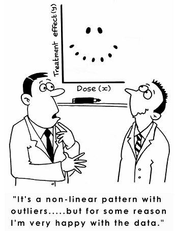
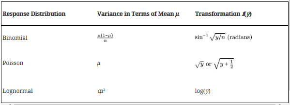

```{r setup, include=FALSE}
knitr::opts_chunk$set(echo = TRUE)
if(!require(daewr)){
  install.packages("daewr")
}
if(!require(tidyverse)){
  install.packages("tidyverse")
}
if(!require(MASS)){
  install.packages("MASS")
}
if(!require(agricolae)){
  install.packages("agricolae")
}
if(!require(multcomp)){
  install.packages("multcomp")
}
  library(daewr)
  library(tidyverse)
  library(MASS)
  library(agricolae)
  library(multcomp)
```

# Introduction

This document will cover in depth the use of DoE experiments in R! We will focus our attention to measuring treatment effects, not variances.  

Based on the work:  
_Lawson, John. Design and Analysis of Experiments with R. Chapman and Hall/CRC, 20141217. VitalBook file._



# Definitions

* Experiment (also called a Run) is an action where the experimenter changes at least one of the variables being studied and then observes the effect of his or her actions(s). Note the passive collection of observational data is not experimentation.  

* Experimental Unit is the item under study upon which something is changed. This could be raw materials, human subjects, or just a point in time.  

* Sub-Sample, Sub-Unit, or Observational Unit When the experimental unit is split, after the action has been taken upon it, this is called a sub-sample or sub-unit. Sometimes it is only possible to measure a characteristic separately for each sub-unit; for that reason they are often called observational units. Measurements on sub-samples, or sub-units of the same experimental unit, are usually correlated and should be averaged before analysis of data rather than being treated as independent outcomes. When sub-units can be considered independent and there is interest in determining the variance in sub-sample measurements, while not confusing the F-tests on the treatment factors, the mixed model described in Section 5.8 should be used instead of simply averaging the sub-samples.  

* Independent Variable (Factor or Treatment Factor) is one of the variables under study that is being controlled at or near some target value, or level, during any given experiment. The level is being changed in some systematic way from run to run in order to determine what effect it has on the response(s).  

* Background Variable (also called a Lurking Variable) is a variable that the experimenter is unaware of or cannot control, and which could have an effect on the outcome of the experiment. In a well-planned experimental design, the effect of these lurking variables should balance out so as to not alter the conclusion of a study.  

* Dependent Variable (or the Response denoted by Y) is the characteristic of the experimental unit that is measured after each experiment or run. The magnitude of the response depends upon the settings of the independent variables or factors and lurking variables.  

* Effect is the change in the response that is caused by a change in a factor or independent variable. After the runs in an experimental design are conducted, the effect can be estimated by calculating it from the observed response data. This estimate is called the calculated effect. Before the experiments are ever conducted, the researcher may know how large the effect should be to have practical importance. This is called a practical effect or the size of a practical effect.  

* Replicate runs are two or more experiments conducted with the same settings of the factors or independent variables, but using different experimental units. The measured dependent variable may differ among replicate runs due to changes in lurking variables and inherent differences in experimental units.  

* Duplicates refer to duplicate measurements of the same experimental unit from one run or experiment. The measured dependent variable may vary among duplicates due to measurement error, but in the analysis of data these duplicate measurements should be averaged and not treated as separate responses.  

* Experimental Design is a collection of experiments or runs that is planned in advance of the actual execution. The particular runs selected in an experimental design will depend upon the purpose of the design.  

* Confounded Factors arise when each change an experimenter makes for one factor, between runs, is coupled with an identical change to another factor. In this situation it is impossible to determine which factor causes any observed changes in the response or dependent variable.  

* Biased Factor results when an experimenter makes changes to an independent variable at the precise time when changes in background or lurking variables occur. When a factor is biased it is impossible to determine if the resulting changes to the response were caused by changes in the factor or by changes in other background or lurking variables.  

* Experimental Error is the difference between the observed response for a particular experiment and the long run average of all experiments conducted at the same settings of the independent variables or factors. The fact that it is called “error” should not lead one to assume that it is a mistake or blunder. Experimental errors are not all equal to zero because background or lurking variables cause them to change from run to run. Experimental errors can be broadly classified into two types: bias error and random error. Bias error tends to remain constant or change in a consistent pattern over the runs in an experimental design, while random error changes from one experiment to another in an unpredictable manner and average to be zero. The variance of random experimental errors can be obtained by including replicate runs in an experimental design.  

# Condensed theory

DoE is used to distinguish between correlation and causality in a way that is cost  efficient and accounts for most confounding effects and lurker effects.  

Sequential strategies are used to determine what factors are most influencial and after that the changes in factors are quantified until finally optimal operating conditions are determined (most appropriate factor states to accomplish maximum treatment effect)  

_DoE Workflow_


An effective experimental design will ensure the following:  

- A *clear objective*  
- An *appropriate design* plan that gaurantees unconfounded and unbiased factor effects    
- A plan for *data collection* to enable estimation of variance and experimental error 
- A stipulation to collect enough data to satisfy the objectives  

In order to achieve this we must: 

1. _Define objectives_  
2. _identify experimental units_  
3. _Define a meaningful and measurable respnse or dependent variable_  
4. _List the independent and lurking vbariables_  
5. _Run pilot tests_  
6. _Make a flow diagram of the experimental procedure_  
7. _Choose the experimental design_  
8. _Determine number of replicants_  
9. _Randomize the experimental conditions to experimental units_  
10. _Describe a method for data analysis with tested dummy data_  
11. _Timetable and budget for resources_  

In particular it's important to note that the time we have to run the experiment and the cost budget for the experiment will heavily impact the type of experimental design

# When to use which design

Let's summarise the theory to understand when we should use which experimental design:


  
Clearly our very first split depends on what we wish to investigate, the variances or the effects of different factors.

**Design Name Acronym Index**

RSE - random sampling experiment

FRSE - factorial random sampling experiment

NSE - nested sampling experiment

SNSE - staggered nested sampling experiment

CRD - completely randomized design

CRFD - completely randomized factorial design

CRFF - completely randomized fractional factorial

PB - Plackett-Burman design

OA - orthogonal array design

CRSP - completely randomized split plot

RSSP - response surface split plot

EESPRS - equivalent estimation split-plot response surface

SLD - simplex lattice design

SCD - simplex centroid design

EVD - extreme vertices design

SPMPV - split-plot mixture process variable design

RCB - randomized complete block

GCB - generalized complete block

RCBF - randomized complete block factorial

RBSP - randomized block split plot

PBIB - partially balanced incomplete block

BTIB - balanced treatment incomplete block

BIB - balance incomplete block

BRS - blocked response surface

PCBF - partially confounded blocked factorial

CCBF - completely confounded blocked factorial

LSD - Latin-square design

RCD - row-column design

## Study factor effects

We start off with the objective of studying factor effects on treatment response. We will illustrate the basic workflows using a simple 1 factor CRD with 1 response.

### Completely randomized design (CRD)


In completely randomized designs we consider only a single factor. For each possible state of this factor we have a treatment or group. The total number of experimental units n is equal to the number of treatments * the number of replications in of each treatment.

**Replications are vital!**   
Without replications we couldn't tell if the treatment effect was real or due to random manifistation of unmeasured effects.

**Remember**:  
By randomly assigning treatments and replications we `balance out` the effects we are not aware of (law of large numbers fighting off lurker effects). We therefore assume any affects we do not account for are equally distributed accross treatments on average.  

**Sub-samples are not replicates!**  
Having two independant tasters taste/rate the same cake does not mean you have two replicates of that particular cake's treatment.  

#### Example

**Bread dough experiment**

Test bread rise height caused by factor time:  

We test 3 values for time with 4 replicates each (12 experimental units of 3 treatments with 4 replicates)  

```{r}
set.seed(234789)
f <- factor(rep(c(35,40,45),each = 4))
randomized_times <- sample(f,12)
allocation <- 1:12
design <- data.frame(allocated_loaf = allocation, time = randomized_times)
design
```

#### Linear model used for CRD inference

Obviously we are only making inference about the mean effect within each treatment given the replications:  
**Cell mean model**  
$Y_{ij} = \mu_i + \epsilon_{ij}$ 
  
A more useful representation:  
**Effects model**  
$Y_{ij} = \mu + \tau_i + \epsilon_{ij}$  
This formulation is more useful because $\tau_i$ is interpreted as the difference of the mean within treatment $i$ and the overall average.

If the design is executed properly the log likelihood function will be maximised if we minimise the sum of squares of residuals (linear regression).

**BUT** in R the `lm()` function will omit the first factor $\tau_1$ and derive coefficients relative to $\mu + \tau_1$:

<!-- First we turn the design into its matrix notation   -->

```{r}
bread_example <- daewr::bread

bread_example %>% lm(formula = height~time) %>% summary
```

So we can see the lm() function did not derive a coefficient for the time = 35 factor level. In this call the intercept is interpreted as $\mu + \tau_1$ and the other factor levels are all evaluated relative to this intercept:


Obviously from this equation it's easy to derive e.g. $\mu + \tau_2$ by adding the 1st and second coefficients together...

#### Hypothesis test for No Treatment Effect

Now let's test if the treatment (changing the time factor) has any affect on the response variable (the height of the baked bread):

$$\begin{align}
H_0:& \tau_i = \tau_j \  \forall \  {i,j} \\
H_1:& \textrm{atleast 2 } \tau_i \textrm{'s differ} 
\end{align}$$

```{r}
bread_example %>% aov(formula = height~time) %>% summary
```

So we can see that the p-value here is the same as the p-value in the lm() summary and since it is < 0.05 we can safely reject $H_0$ and say different time factor levels had a significant impact on the response variable height.

#### Verify linearity assumption

Of course, using a lm() model assumes linearity and we should validate this assumed relationship between time and height:

#### Assumptions validation function

```{r}
Validate_assumptions <- function(df, formula_ = NULL, model, factor, response) {
  qq_plot <- 
    df %>% 
    ggplot(aes(sample = model %>% residuals))+
    stat_qq()+
    ggtitle("QQ plot of residuals")+
    xlab("")+
    ylab("")
  
  Res_fac <- df %>% 
    ggplot()+
    geom_point(aes(y = model %>% residuals(), x = df[,factor] ))+
    ggtitle("Residuals VS factor levels") +
    xlab("Residuals")+
    ylab("Factor levels")

  Res_fit <- df %>% 
    ggplot(aes(y = model %>% residuals(), x = model %>% predict))+
    geom_point()+
    ggtitle("Residuals VS fitted")+
    xlab("Residuals")+
    ylab("fitted")
  
  Res_eu <- df %>% 
    ggplot(aes(y = model %>% residuals(), x = seq(nrow(df))))+
    geom_point()+
    ggtitle("Residuals VS experimental unit")+
    xlab("Residuals")+
    ylab("Experimental unit")
  
  multiplot <- function(..., plotlist=NULL, file, cols=1, layout=NULL) {
  library(grid)

  # Make a list from the ... arguments and plotlist
  plots <- c(list(...), plotlist)

  numPlots = length(plots)

  # If layout is NULL, then use 'cols' to determine layout
  if (is.null(layout)) {
    # Make the panel
    # ncol: Number of columns of plots
    # nrow: Number of rows needed, calculated from # of cols
    layout <- matrix(seq(1, cols * ceiling(numPlots/cols)),
                    ncol = cols, nrow = ceiling(numPlots/cols))
  }

 if (numPlots==1) {
    print(plots[[1]])

  } else {
    # Set up the page
    grid.newpage()
    pushViewport(viewport(layout = grid.layout(nrow(layout), ncol(layout))))

    # Make each plot, in the correct location
    for (i in 1:numPlots) {
      # Get the i,j matrix positions of the regions that contain this subplot
      matchidx <- as.data.frame(which(layout == i, arr.ind = TRUE))

      print(plots[[i]], vp = viewport(layout.pos.row = matchidx$row,
                                      layout.pos.col = matchidx$col))
    }
  }
}
  
  multiplot(qq_plot, Res_fac, Res_fit, Res_eu, cols=2)
  
}

Validate_assumptions(df = bread_example,model =  bread_example %>% lm(formula = height~time), factor = "time") 

# qqnorm(y = bread_example %>% lm(formula = height~time) %>% residuals)
```

In this case we do seem to have a fairly normal response relationship but with some variability in the lower corner. Consider that we only have 12 points.

A more serious violation of assumption is heterogeneity of variances. In general when the linearity assumption is violated so will the homogeniety of variances assumption. To remedy this we can apply a transformation to the data to reconsile the linearity assumption.

#### Box-Cox Power Transformations

** When variation is relative to the mean observation within each treatment **

This transformation will change the data so that it is distributed normally. Normally distributed data has honogeneous variances    

These transformations ensure that $\sigma \propto \mu^{1 - \lambda}$

To find $\lambda$ we can do:

```{r}
box_cox <- boxcox(aov(bread_example,formula = height~time))
lambda = box_cox$x[which(box_cox$y == box_cox$y %>% max)]
lambda
```

Now we transform the data:  

```{r}
bread_example_transformed <- 
  bread_example %>% 
  mutate(height = height^lambda)
```

Let's redo the normality validation on residuals: 

```{r}
qqnorm(y = bread_example_transformed %>% lm(formula = height~time) %>% residuals())
```

And if we look at the hypothesis test with the now normally distributed data:

```{r}
bread_example_transformed %>% aov(formula = height~time) %>% summary
```

Our new p-value is smaller which indicates that an observation as or more extreme than what we have is even more unlikely under the null hypothesis that there is no treatment effect.

#### Distributional transformations

** When variation is relative to the mean observation within each treatment **

An alternative to box-cox power transformation



OK, well let's use the lognormal transformation and see the effect on the anova:

```{r}
bread_example_lognormal <- 
  bread_example %>% 
  mutate(height = log(height))
```

Let's redo the normality validation on residuals: 

```{r}
qqnorm(y = bread_example_lognormal %>% lm(formula = height~time) %>% residuals())
```

In this case we seem to fit the tail distribution better...  

And if we look at the hypothesis test with the now more? normally distributed errors:

```{r}
bread_example_lognormal %>% aov(formula = height~time) %>% summary
```

The p-value is again shifted towards 0.0258 which indicates with higher certainty that we reject the null hypothesis

### Alternatives to least squares regression

#### Weighted linear model

When we believe the **heterogeneous variances are not related to the treatment mean** we can use a weighted least squares

Use sd() as weights within treatments:  

```{r}

bread_example_Weighted <- 
    bread_example %>% 
  group_by(time) %>% 
  mutate(sd_treatment = 1/sd(height))
bread_example_Weighted
```

Now that we have the weights for each treatment we can use it in a weighted OLS:  

```{r}
bread_example_Weighted %>% lm(formula = height~time,weights = bread_example_Weighted$sd_treatment) %>% summary
```

This gives us a p-value of 0.02006 which is very similar to the other transformed methods  

#### Creating a weighted OLS function

So to generalize this for simple case of CRD:

```{r}
weighted_ols_anova <-  function(df, formula_, factor, response) {
  factor_enq <- dplyr::enquo(factor)
  response_enq <- dplyr::enquo(response)
  # factor_quo <- dplyr::quo(factor)
  # response_quo <- dplyr::quo(response)
  df <- 
    df %>% 
  group_by(!!factor_enq) %>%
  mutate(sd_treatment = 1/sd(!!response_enq)) %>% 
    ungroup
  
   # y = df %>% select(!!response_enq) %>% flatten_dbl
   # x = df %>% select(!!factor_enq) %>% flatten_dbl
  
    df %>% lm(formula =  formula_, weights = sd_treatment) %>% anova
    # df %>% lm(y = y, x = x, weights = sd_treatment) %>% anova

  # return(df)
}

weighted_ols_anova(bread,height~time,time,height)
```

#### Generalized linear models

**Pol data using logistic link function assuming multinomial distribution**

Participants were asked to rank a treatment from 1 to 5  

Data:

```{r}
mod_full <- MASS::polr(data = daewr::teach,
                   formula = score ~ method,
                   weight = count)

mod_reduced <- MASS::polr(data = daewr::teach,
                   formula = score ~ 1,
                   weight = count)

anova(mod_full,mod_reduced)

```

The reduced model predicts assuming only a global mean which conceptually means:  
$y_{i,j} = \mu + \epsilon_{i,j} \ \ \  VS \ \ \  y_{i,j}=\mu + \tau_i +  \epsilon_{i,j}$

This shows that using different methods does make a difference compared to no particular method used. Because the p-value here rejects the null hypothesis that the two models are the same and therefore rejects the null hypothesis that all treatment effects are the same: $\mu_i = \mu_j \  \forall \  {i,j}$

**How do we measure treatment effect?**  

Let's visualize the scores by method used

```{r}
# Predicted <- 
#   daewr::teach %>% 
#   mutate(predicted_score = mod_full %>% predict)

# Predicted %>% 
#   group_by(method) %>% 
#   nest %>% 
#   mutate(Histogram = data %>% map(~hist(.$score))) %>% 
#   .Histogram

daewr::teach %>% 
  ggplot()+
  geom_bar(aes(x = score,y = count),stat = "identity")+
  facet_wrap(~method)+
  ggtitle("Distribution of scores by method",subtitle = "Method 3 appears to outperform")

daewr::teach %>% 
  mutate_if(is.factor,as.numeric) %>% 
  group_by(method) %>% 
  summarise(mean_score = sum(score*count)/sum(count),
            Total_votes = sum(count))
```

We can see that on average the 3rd treatment here would outperform the rest of the treatment groups from this designed experiment.

**Test for assumption violations**

We can't repeat the usual battery of tests here since we are dealing with a categorical response and the idea of residual error should be defined differently from say  $y-\hat{y}$.


<!-- bread_example_lm <- daewr::bread %>% lm(formula = height~time) -->
<!-- Validate_assumptions(df = daewr::bread, -->
<!--                      model = bread_example_lm, -->
<!--                      factor = "time", -->
<!--                      response = "height") -->

In order to run the usual battery of validity tests we need the residuals of the fitted model. However, this is a categorical response experiment.

```{r,eval=FALSE}
# Validate_assumptions(df = daewr::teach, model = mod_full)
```

#### Deternining the number of replicates

**Bread dough experiment**

The idea of `practical difference` is important here. If the practitioner wants to monitor any difference in `cell means` larger than say 3 inches he would use the `Fpower1` function with $\Delta = 3$.

`Fpower1` calculates the power of the 1 way anova F distribution

Now we specify the number of replications we would like to calculate the power for given we know the variance of the experimental error $\hat{\sigma}^2$ 

If we assume the naive OLS this value is:  

```{r}
daewr::bread %>% lm(formula = height~time) %>% residuals() %>% var
```

Let's assume the value $\hat{\sigma}^2 = 1.917614$

```{r}
power <- Fpower1(alpha = rep(0.05, 6-2+1),
                 nlev = 3,
                 nreps = 2:6, 
                 Delta = 3,
                 sigma = sqrt(1.917614)
                )
power
```

This table then shows us that with as many as 6 replicates per treatment we can detect with ~87% accuracy a `cell mean` shift of 3 inches.  

Based on the affordability in terms of time and money we can limit the factor under investigation using screening designs and perhaps limit the number of factors such that we get enough power out of the affordable number of replications.  

#### Choosing optimal treatments

In general it is possible to construct hypothesis tests of comparisons before the design of experiments is carried out and responses are recorded but we will not focus on that here.

Instead we will assume the practitioner is interested in comparing treatments to one another in an unbiased way or compared to the current control treatment being used.

#### Unplanned Comparisons

When comparing specific treatments with one another _after_ the experiment has been designed and carried out we must adjust for bias.

In R we can use the `TukeyHSD` function to compare cell mean shifts between different treatments  

**Sugarbeet dataset**

This dataset is another CRD design. Let's illustrate the TukeyHSD function here:  

```{r}
Sugerbeet_anova <- aov(yield ~ treat, data = daewr::sugarbeet)

Sugerbeet_anova

Sugerbeet_TukeyHSD <- TukeyHSD(Sugerbeet_anova, ordered = TRUE)

Sugerbeet_TukeyHSD
```

Here we can see that treatments `C and D` do not reject the null hypothesis that they have different cell means. However, the test also shows that no other treatments are considered the same and all reject at 5%. 

Based purely on the confidence interval showed we could conclude that treatments `C and D` appear to be the most optimal if a higher mean in the response was required.

This function does not explicitly tell us what those means are, merely their differences.

**Another, more conservative, function we can use is the `SNK.test` function from the agricolae package**:  

```{r}
Sugarbeet_SNK <- SNK.test(Sugerbeet_anova, "treat", alpha = 0.05)

Sugerbeet_anova
```

This time we can clearly see the treatment means along with their summary statistics. As for rejection of the null hypothesis we can compare the `M` column in the groups output. Treatments that did not reject the null would have the same letters here.  

**Comparison to the current control treatment**

To compare different treatments to the current control treatment we can use the function `glht` from the multcomp package  

**The glht function assumes that the 1st factor level is in fact the control treatment**  

```{r}
Sugarbeet_glht <- glht(Sugerbeet_anova,linfct = mcp(treat = "Dunnett"), alternative = "greater")

Sugarbeet_glht %>% summary
```

By specifying `alternative = "greater"` we can test the null hypothesis of the `cell mean` being greater than that of the control treatment using the `Dunnett` method.  

Here we can again see that treatments `C and D` are superior to the control treatment `A`.